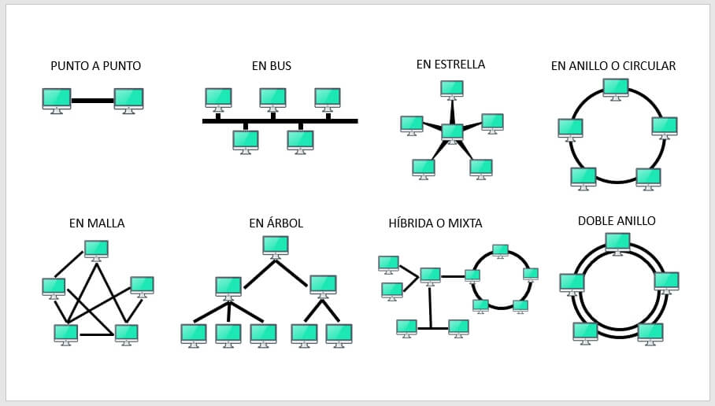

## Índice

1. [Introducción a las redes de datos](#introducción-a-las-redes-de-redes) [↗](#Introducción%20a%20las%20redes%20de%20datos)

2. [Conceptos básicos](#conceptos-básicos) [↗](#Conceptos%20básicos)

3. [Tipos de Topología](#tipos-de-topología) [↗](#Tipos%20de%20Topología)

# Introducción a las redes de datos

Las redes permiten el intercambio de información recursos y servicios entre dispositivos conectados.

# Conceptos básicos 

## 1.1 Redes de comunicaciones de datos. Panorama general

- **Infraestructura de Red:**
	- Las redes se componen de una infraestructura física y lógica.
	
- **Conectividad Ubicua:**
	- Las redes permiten estar conectados en cualquier momento y lugar, facilitando la colaboración y el acceso a recursos.
	
- **Procesamiento y Almacenamiento:**
	- Las redes facilitan el procesamiento y almacenamiento a gran escala en centros de datos.

## 1.2 Beneficios de las redes locales. Usos y aplicaciones

- Colaboración
- Eficiencia 
- Seguridad
- Escalabilidad

## 1.3 Topologías. Importante consideración de diseño

- **Topología Física:**
	- Es la disposición real de los cables y dispositivos.
	
- **Topología Lógica:**
	- Es la forma en que viajan los datos, aunque físicamente sea diferente.

>[!Note]
> Aunque físicamente sea estrella, puede comportarse como bus.

La topología afecta el **rendimiento** (la velocidad, confiabilidad y escalabilidad de la red). Algunas topologías requieren más hardware y cableado lo que impacta en el **costo**. La topología determina la capacidad de la red para adaptarse a cambios y crecimineto (**flexibilidad**).

# Tipos de Topología 

## Topología en estrella

**Centralizado:**
- Todos los dispositivos se conectan a un punto central (conmutador o concentrador).
	
	- Un conmutador de red (conocido en inglés como _switch_) es un dispositivo físico o lógico que conecta múltiples equipos entre sí dentro de una misma red local (LAN) para que puedan comunicarse y compartir recursos.

**Fácil de expandir:**
- Agregar nuevos dispositivos es sencillo, conectándolos al punto central.
	
**Vulnerabilidad:**
- Si falla el punto central, todo la red se ve afectada.

## Topología en árbol

**Estructurada:**
- Los dispositivos se organizan en una jerarquía de ramas y subramas.
	
**Escalabilidad:** 
- Permite expandir la red fácilmente.
	
**Redundancia:**
- Si falla una rama, solo se ve afectada esa sección de la red.

## Topología en anillo

**Conexión circular:**
- Los dispositivos se conectan en un "círculo", formando un bucle cerrado.
	
**Resiliente:**
- Si falla una conexión, los datos pueden circular en la dirección opuesta.
	
**Limitada:**
- El rendimiento se ve afectado a medida que se agregan más dispositivos.

### Anillo doble

- Utiliza dos anillos concéntricos independientes donde cada dispositivos se conecta a ambos para ofrecer redundancia y evitar que la red caiga si un anillo falla.

## Topología en bus

**Sencilla:**
- Todos los dispositivos se conectan a un solo cable de comunicación (`bus`).
	
**Económica:**
- Requiere menos cableado y hardware que otras topologías.
	
**Vulnerable:**
- Si el bus falla, toda la red se ve afectada.
	
**Limitada:**
- El rendimiento  se degrada a medida que se agregan más dispositivos.

## Topología en malla

**Redundancia:**
- Múltiples rutas entre dispositivos mejoran la confiabilidad.
	
**Escalabilidad:**
- Agregar nuevos dispositivos es sencillo sin afectar el rendimiento.
	
**Complejidad:**
- El diseño y la configuración de la red son más complejos.
	
**Costo:**
- Requiere más hardware y cableado de otras topologías.

# Evolución de las redes de datos

### Cobertura geográfica

**LAN:** Redes de área local.
**WAN:** Redes de área global.

## Evolución de las tecnologías de red

- **ALOHA:** Uno de los primeros protocolos de acceso aleatorio que sentó las bases para las redes inalámbricas. En 1970 Abramson crea la red ALOHAnet en la Universidad de Hawaii utilizando emisoras de radio taxis viejos.
	
	- **ALOHA Puro:** Transmisión de las estaciones en tiempos aleatorios. Tramas de longitud igual o diferente.
	
	- **ALOHA Ranurado:** Transmisión de las estaciones en tiempos sincronizados. El tiempo se divide en intervalos y cada `trama` se transmite en uno y solo un intervalo. Todas las tramas duran lo mismo (misma longitud).

> [!Note] 
> La **arquitectura maestro-esclavo** (o _master-slave_) en redes es un modelo de comunicación jerárquico en el que un dispositivo central (el maestro) ejerce un control unidireccional y absoluto sobre uno o más dispositivos secundarios (los esclavos).
> 
> La comunicación `Esclavo` -> `Maestro` puede sufrir colisiones.

> [!Note]
> La **densidad de tráfico inyectado en la red** se refiere a la cantidad total de datos (paquetes, bits o mensajes) que los usuarios o dispositivos envían activamente hacia la red en un espacio de tiempo determinado.
>
En palabras sencillas, mide **qué tan cargada o "saturada" está la entrada de la red** debido a la demanda de los dispositivos conectados.

- **X.25:** Estándar de conmutación de paquetes que permitió la interoperabilidad de redes de datos.
	
	- Protocolo fiable y orientado a conexión que establece comunicaciones seguras mediante circuitos virtuales.
	
	- El objetivo era conectar computadoras y terminales a través de la red telefónica pública usando conmutación de paquetes.

> [!Note] Conmutación de paquetes
> Es el método de envío de datos utilizado por Internet y la mayoría de las redes locales modernas, en el cual la información se divide en trozos pequeños llamados **paquetes** antes de ser enviada.
>
Cada paquete viaja de forma **independiente** a través de la red y, al llegar a su destino, se vuelven a unir para reconstruir el mensaje original.

- **Ethernet:** Tecnología de red local (LAN) ampliamente adoptada por su sencillez y eficiencia.